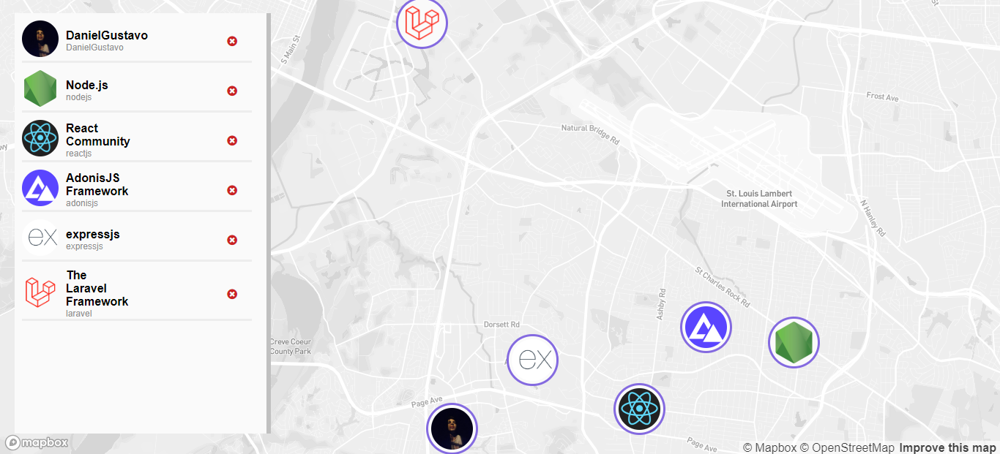

# DevMap
Web page where you can move devs from anywhere to anywhere on the globe.


# Why
This project has no functional purpose, I just made it because I want to improve my knowledge at [ReactJS](https://reactjs.org).

# Installation and execution
1. Clone the repository;
2. Create the file ".env.local" in the project folder;
3. Sign up at [Mapbox](https://www.mapbox.com/) and get your token;
4. Inside the ".env.local" put ```REACT_APP_MAPGL_TOKEN=your_mapbox_token```;
5. Enter the project running ```cd devMap```;
6. Run ```yarn``` to install the dependencies;
7. Run ```yarn start``` to initializate the server.

# Technologies
- ReactJS
